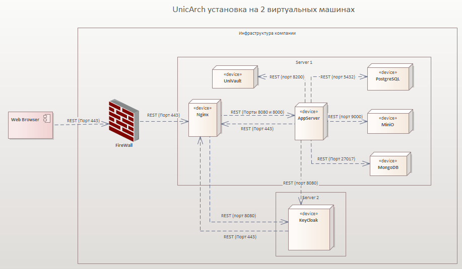
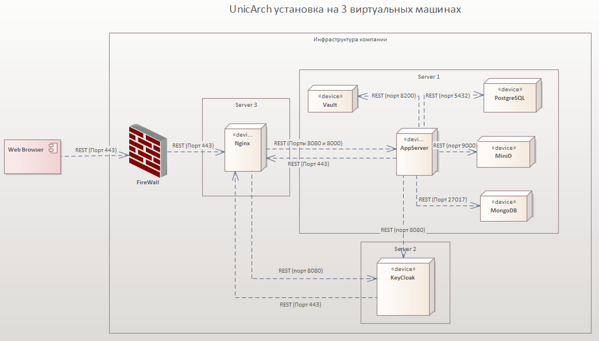

# Установка UnicArch с доступом по https

## Оглавление
- [1. Схемы развертывания](#1-схемы-развертывания)
- [2. Необходимые данные для установки](#2-необходимые-данные-для-установки)
- [3. Доступ к репозиторию](#3-доступ-к-репозиторию)
- [4. Клонирование репозитория](#4-клонирование-репозитория)
- [5. Краткое описание переменных в файле initconfig.txt](#5-краткое-описание-переменных-в-файле-initconfigtxt)
- [6. Настройка проксирующего сервера (nginx)](#6-настройка-проксирующего-сервера-nginx)
- [7. Настройка Keycloak](#7-настройка-keycloak)
- [8. Настройка UnicArch](#8-настройка-unicarch)
- [9. Рекомендации и проверка](#9-рекомендации-и-проверка)

## 1. Схемы развертывания

### Схема на 2 сервера


В этой схеме:
- Сервер 1: Nginx (прокси) + Keycloak.
- Сервер 2: UnicArch с базами данных (PostgreSQL, MongoDB, MinIO, Redis, Vault).

### Схема на 3 сервера


В этой схеме:
- Сервер 1: Nginx (прокси).
- Сервер 2: Keycloak.
- Сервер 3: UnicArch с базами данных (PostgreSQL, MongoDB, MinIO, Redis, Vault).

## 2. Необходимые данные для установки

- Запросите Docker-образ `ua_appserver` (или другие необходимые образы UnicArch) у команды разработки.
- Укажите доменные имена для:
  - Keycloak (например: `https://auth.yourcompany.com`).
  - UnicArch (например: `https://unicarch.yourcompany.com`).
- Укажите IP-адреса серверов для Keycloak и UnicArch (в зависимости от схемы).
- Напишите на почту `support@unicomm.pro` для получения образа ua.webui.

Убедитесь, что порты ( 80, 443 для Nginx; 8080 для Keycloak) открыты и доступны.

### Добавление записей в /etc/hosts

Для корректной работы системы по HTTPS добавьте IP-адрес Nginx-сервера и DNS-имена сервисов в файл `/etc/hosts` **на  серверах UnicArch и Keycloak **:

```bash
sudo nano /etc/hosts
```

Добавьте строки следующего вида:

```
<IP_адрес_Nginx_сервера>  unicarch.yourcompany.com auth.yourcompany.com
```

Пример:

```
192.168.10.20  unicarch.yourcompany.com auth.yourcompany.com
```

После сохранения файла убедитесь, что доменные имена успешно разрешаются:

```bash
ping unicarch.yourcompany.com
ping auth.yourcompany.com
```

## 3. Доступ к репозиторию

Для скачивания образов Unicomm выполните:
```bash
docker login --username oauth \
  --password y0_AgAAAAB3muX6AATuwQAAAAEawLLRAAB9TQHeGyxGPZXkjVDHF1ZNJcV8UQ \
  cr.yandex
```

## 4. Клонирование репозитория

Клонируйте репозиторий
``` bash
git clone -b   skonstantinov  https://github.com/unicommorg/unicarch.git
```
После клонирования в репозитории будут скрипты (`deploy_ua.sh`, `deploy_nginx.sh`, `deploy_kk.sh`) и директории (`ua/`, `nginx/`, `kk/`).

## 5. Краткое описание переменных в файле initconfig.txt

Этот файл содержит настройки для развертывания UnicArch, Nginx и Keycloak. Заполните его перед запуском скриптов. 
Пароли должны быть без спецсимволов

### 1. База данных MongoDB
| Переменная                  | Назначение                       | Изменить / По умолчанию |
|-----------------------------|----------------------------------|-------------------------|
| `MONGO_INITDB_ROOT_USERNAME` | Имя администратора MongoDB     | **Изменить** (например: `admin`) |
| `MONGO_INITDB_ROOT_PASSWORD` | Пароль администратора           | **Изменить** (сгенерируйте сильный пароль) |
| `MONGO_INITDB_DATABASE`     | Имя базы данных для логов       | **По умолчанию**: `ualogs` (можно оставить) |

### 2. База данных PostgreSQL
| Переменная                 | Назначение                     | Изменить / По умолчанию |
|----------------------------|--------------------------------|-------------------------|
| `POSTGRES_DB`              | Имя базы данных приложения     | **Изменить** (например: `ua_db`) |
| `POSTGRES_DB_USER`         | Пользователь PostgreSQL        | **Изменить** (например: `postgres`) |
| `POSTGRES_DB_PASSWORD`     | Пароль пользователя            | **Изменить** (сгенерируйте сильный пароль) |

### 3. Настройки MinIO (объектное хранилище)
| Переменная                | Назначение                     | Изменить / По умолчанию |
|---------------------------|--------------------------------|-------------------------|
| `MINIO_ROOT_USER`         | Имя пользователя MinIO         | **Изменить** (например: `minioadmin`) |
| `MINIO_ROOT_PASSWORD`     | Пароль для MinIO               | **Изменить** (сгенерируйте сильный пароль) |
| `MINIO_ENDPOINT`          | Внутренний endpoint MinIO      | **По умолчанию**: `ua.minio:9000` (оставить для Docker-сети) |

### 4. Настройки Redis (кэш)
| Переменная                | Назначение                     | Изменить / По умолчанию |
|---------------------------|--------------------------------|-------------------------|
| `REDIS_URL`               | URL подключения к Redis        | **По умолчанию**: `ua.redis:6379` (оставить для Docker-сети) |

### 5. Настройки Keycloak (аутентификация)
| Переменная                | Назначение                     | Изменить / По умолчанию |
|---------------------------|--------------------------------|-------------------------|
| `KEYCLOAK_REALM`          | Имя realm в Keycloak           | **По умолчанию**: `ua` (можно оставить) |
| `KEYCLOAK_CLIENT`         | Имя клиента в Keycloak         | **По умолчанию**: `ua-frontend-client` (можно оставить) |
| `KEYCLOAK_AUDIENCE`       | Аудитория для токенов          | **По умолчанию**: `account` (оставить) |
| `KEYCLOAK_URL`            | Внешний URL Keycloak           | **Изменить** (например: `https://auth.yourcompany.com`) |
| `KEYCLOAK_SERVER_IP`      | IP-адрес сервера Keycloak      | **Изменить** (реальный IP сервера) |

### 6. Frontend настройки (Vite)
| Переменная                | Назначение                     | Изменить / По умолчанию |
|---------------------------|--------------------------------|-------------------------|
| `VITE_ALLOWED_HOSTS`      | Разрешенные домены для фронтенда | **Изменить** (например: `unicarch.yourcompany.com`) |
| `VITE_KEYCLOAK_URL`       | URL Keycloak для фронтенда     | **Изменить** (должен совпадать с `KEYCLOAK_URL`) |
| `VITE_KEYCLOAK_REALM`     | Realm для фронтенда            | **По умолчанию**: `ua` (совпадает с `KEYCLOAK_REALM`) |
| `VITE_KEYCLOAK_CLIENT`    | Клиент для фронтенда           | **По умолчанию**: `ua-frontend-client` (совпадает с `KEYCLOAK_CLIENT`) |
| `VITE_HOST_URL`           | Внешний URL API                | **Изменить** (например: `https://api.yourcompany.com/api`) |
| `UNICARCH_SERVER_IP`      | IP-адрес сервера UnicArch      | **Изменить** (реальный IP сервера) |

### 7. Настройки Vault (секреты и SSL)
| Переменная                | Назначение                     | Изменить / По умолчанию |
|---------------------------|--------------------------------|-------------------------|
| `VAULT_ADDR`              | Адрес Vault                    | **По умолчанию**: `http://vault` (оставить для Docker) |
| `VAULT_TOKEN`             | Токен Vault (генерируется скриптом)| Автоматически (не трогать) |
| `SSL_EMAIL`               | Email для SSL-сертификатов     | **Изменить** (например: `admin@yourcompany.com`) |

### Рекомендации
- **Изменяйте**: Все пароли, URL, IP и домены под вашу среду.
- **Оставляйте по умолчанию**: Внутренние endpoints (Redis, MinIO, Vault) и стандартные имена (realm, client).
- **Проверка**: Убедитесь в согласованности (например, Keycloak URL везде одинаковый). Тестируйте доступность после заполнения.
- Генерируйте логины и пароли без спецсимволов (избегайте символов вроде `:`, `/`, `\` для избежания проблем с URL-encoding).

## 6. Настройка проксирующего сервера (nginx)

Перенесите `deploy_nginx.sh`, директорию `nginx/` и `initconfig.txt` на сервер, где планируете развернуть Nginx.

Перейдите на сервер:
```bash
sudo su
chmod +x deploy_nginx.sh
./deploy_nginx.sh
```

- Запустите скрипт и следуйте меню. Рекомендуется выбрать **"100. 🚀 Полная автоустановка (все этапы)"** для автоматизации.
- Скрипт проверит/установит Nginx и Certbot, настроит конфиги, получит SSL-сертификаты (Let's Encrypt) и перезапустит Nginx.
- Если сертификаты уже существуют, скрипт предложит их обновить.

После настройки проверьте статус: выберите "11. 📊 Показать статус".

## 7. Настройка Keycloak

Перенесите `deploy_kk.sh`, директорию `kk/` и `initconfig.txt` на сервер, где планируете развернуть Keycloak.

Перейдите на сервер:
```bash
sudo su
chmod +x deploy_kk.sh
./deploy_kk.sh
```

- Запустите скрипт и следуйте меню. Рекомендуется выбрать **"100. 🚀 Полная автоустановка с Docker"** для автоматизации.
- Скрипт проверит/установит Docker, создаст сеть, настроит `.env` и `docker-compose.yml`, настроит realm (файл `unicarch_realm_modified.json`), запустит Keycloak и импортирует realm.
- По умолчанию админ-логин/пароль: `admin`/`admin` (измените в `.env` после установки).

После настройки проверьте статус: выберите "11. 📊 Показать статус" и "12. 🔍 Проверить realm".

## 8. Настройка UnicArch

Перенесите `deploy_ua.sh`, директорию `ua/`, `initconfig.txt`, SQL-файлы (`structure.sql`, `specific_information.sql`) и Docker-образы на сервер, где планируете развернуть UnicArch.

Перейдите на сервер для настройки ua.
Сделайте исполняемым скрипт от пользователя с правами sudo.
```bash
sudo su
chmod +x deploy_ua.sh
```

Загрузите образ ua.webui (если не установлен docker,  установите docker через скрипт ./deploy_ua.sh )

```bash
docker load -i ua.webui.tar
```

Запустите скрипт
```bash
./deploy_ua.sh
```

- Запустите скрипт и следуйте меню. Рекомендуется выбрать **"100. 🚀 Полная автоустановка (все этапы)"** для автоматизации.
- Скрипт проверит/установит Docker, создаст сеть, инициализирует из `initconfig.txt`, настроит Vault, запустит сервисы и загрузит SQL-файлы в PostgreSQL.

После настройки проверьте статус: выберите "8. 📊 Показать статус сервисов" и "9. 🔍 Проверить состояние системы".

## 9. Рекомендации и проверка

- **Безопасность**: Измените дефолтные пароли Keycloak после установки. Не храните `initconfig.txt` в Git.
- **Проверка**: 
  - Доступ к Keycloak: `https://auth.yourcompany.com` (логин: admin/admin).
  - Доступ к UnicArch: `https://unicarch.yourcompany.com`.
  - Логи: `docker compose logs` в директориях `ua/` и `kk/`.
- **Обновления**: Для обновления конфигов используйте опции "7. 🔄 Обновить все конфигурации" в `deploy_nginx.sh`.
- **Проблемы**: Если ошибки, проверьте логи Docker, сетевые настройки и порты. Обратитесь в поддержку.

После всех шагов система должна быть готова к работе.
